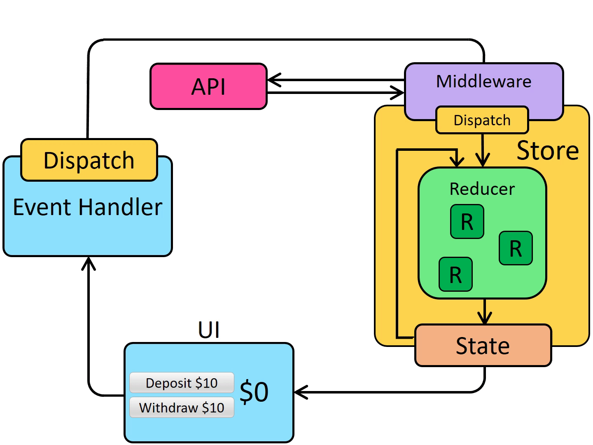

# Redux Thunk

- Cài đặt dự án `yarn install`
- Chạy dự án `yarn start`

## Giới thiệu

> Redux Thunk là middleware dành cho Redex, cho phép viết action creators trả về function thay vì plain object. Điều này giúp xử lý bất đồng bộ (async) trong Redux như gọi API, delay hoặc chạy các logic phức tạp trước khi thực sự dispatch action thật sự
> 

### Lưu ý

- Để việc cấu hình được ngắn gọn và đơn giản, tài liệu sẽ sử dụng Redux Toolkit để viết Redux Thunk
- Redux Toolkit đã được tích hợp sẵn các phương thức và cấu trúc để tương tác với Redux Thunk một cách nhanh chóng và dễ dàng nhất

## Cách Redux Thunk hoạt động



1. Mọi hành động đều diễn ra bình thường cho đến khi người dúng thực hiện event handler và bắn dispatch đi
2. Lúc này sẽ có một lớp Middleware ngăn cách giữa đường truyền từ dispatch đến reducer
3. Trong Middleware sẽ xử lý các logic bất đồng bộ (async) hoặc những logic phức tạp rồi sau đó mới bắn đi dispatch thực sự

## Cách cấu hình Thunk (Async)

### Tạo Action Creator

- Action creator (async) sẽ được tạo với phương thức có sẵn `createAsyncThunk` của redux toolkit. Truyền vào `type` và `callback` xử lý logic
- `Callback` có thể có nhiều param từ bên ngoài truyền vào để thực hiện logic

```js
import { createAsyncThunk } from "@reduxjs/toolkit";

export const fetchTodos = createAsyncThunk(
    "todos/fetchTodos",
    async (param, thunkAPI) => {
        try {
			const res = await fetch("/api/todos");
			const data = await res.json();
			return data.todos;
        }
        catch(error) {
			return thunkAPI.rejectWithValue(error.message);
        }
    }
);
```

### Xử lý slice reducer

- Ngoài trạng thái `fulfilled`, còn 2 trạng thái là `pending` `rejected` . Tùy vào trường hợp mà xử lý logic

```js
import { createSlice } from "@reduxjs/toolkit";
import { fetchTodos, fetchAddTodo, fetchUpdateTodo } from "../thunks/todo-list";

const todoListReducerSlice = createSlice(
    {
        name: "todoList",
        initialState: {
            status: "idle",
            todos: []
        },
        extraReducers: (builder) => {
            builder
                .addCase(
                    fetchTodos.fulfilled,
                    (state, action) => {
						state.status = "idle"
						state.todos = action.payload;
                    }
                )
        }
    }
);

export default todoListReducerSlice;
```

### Dispatch trong Component

```jsx
import { useEffect } from "react";
import { useDispatch } from 'react-redux';
import { fetchTodos } from '../../store/thunks/todo-list';

export default function Example() {
	const dispatch = useDispatch();
	
	useEffect(() => {
		// Logic . . .
		dispatch(
			fetchTodos()
		);
	}, []);
	
	return <></>
}
```

## Cách cấu hình Thunk (Sync)

### Tạo Action Creator

- Chỉ cần viết một hàm bình thường và nhận vào 2 tham số `dispatch` `getState`

```js
export const exampleThunkSync = () => {
	return (dispatch, getState) => {
		// Logic . . .
		dispatch(action);
	}
}
```

### Dispatch trong Component

```jsx
import { useDispatch } from 'react-redux';
import { exampleThunkSync } from ". . .";

export default function Example() {
	const dispatch = useDispatch();
	
	const handleClick = () => {
		// Logic . . .
		dispatch(exampleThunkSync());
	}
	
	return <button onClick={handleClick}>Click Me</button>
}
```
